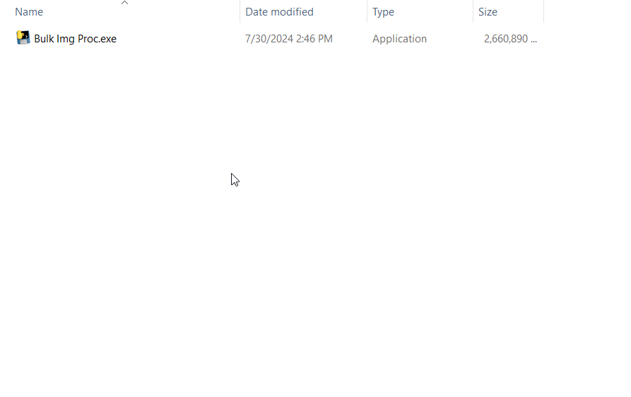
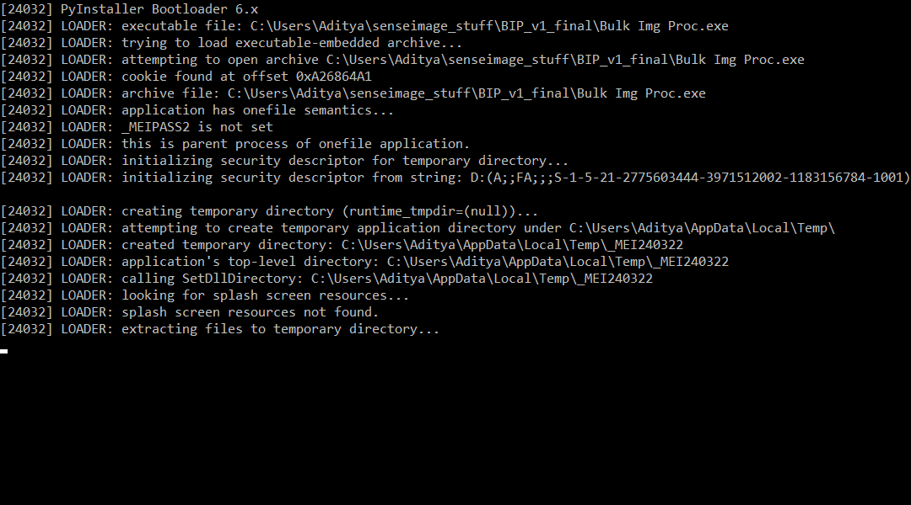
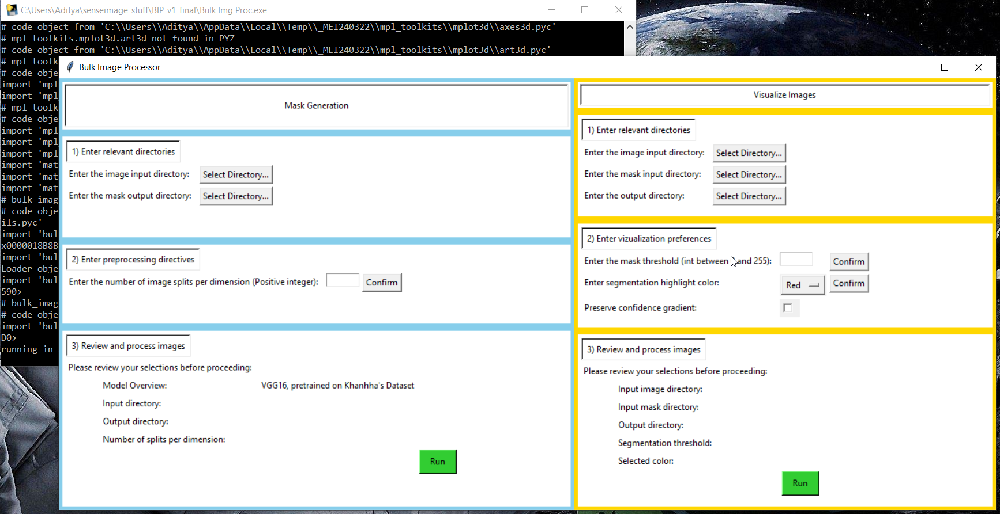
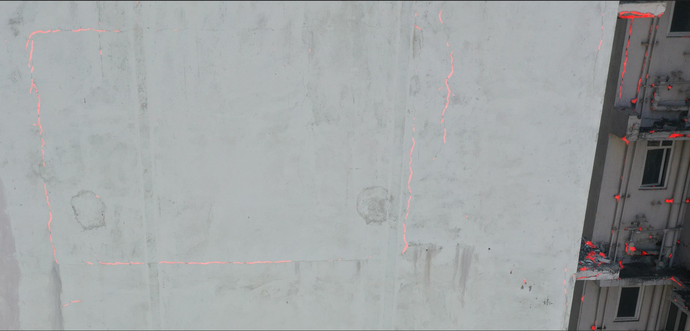

# Bulk Image Processor
 An application to streamline the bulk processing of images.

### About

One-file executable (Google Drive): https://drive.google.com/file/d/1XQx-nIv5bcNiQ6iurAlkbm4_Rmb3fbOZ/view?usp=sharing

Sample images for testing (Google Drive): https://drive.google.com/drive/folders/1J1XNUwHGQuAM23ET66IDhEb0Mgg-NuOL?usp=sharing

As provided, the Bulk Image Processor can create segmentation masks for images, and apply those masks to produce
visualizations of those images.

The segmentation masks are produced using a VGG16 CNN pretrained on Khanhha's crack dataset. Details and the model can
be found at: https://github.com/khanhha/crack_segmentation/tree/master

The model can therefore detect cracks and structural integrity issues in buildings.

This application preprocesses the images before passing them through the model. The images can be split into an array of
smaller images, with the aim of receiving a more accurate model output.

The mask produced assigns a confidence value to each pixel in the image. The visualization section of the application
allows the user to provide a confidence cutoff, and overlay the mask on the source image in the user's choice of color.

The output images can then be used in photogrammetry.

### Dependencies
This application only works on computers running Windows, with an NVIDIA graphics card.

Ensure that your device has CUDA installed: https://developer.nvidia.com/cuda-downloads

If you have the bundled single-executable application file, no additional dependencies are required.

If you intend to run the Python code in a normal Python process, dependencies for this application can be found in
`requirements_conda.txt` and `requirements_pip.txt`, for conda and pip respectively.

Using the conda dependency list is
recommended, since the dependencies were installed using conda, and the pip dependency list does not include the
specific package builds, which is important to consider since pytorch-cuda is intended to be used.

You will also need to add the pretrained model within the `./vgg16_khanhha_related/models` directory.

This application is compatible with Python 3.11.9; I have not tested with other Python versions.

### Execution
To run the application in a Python process, run the `__main__.py` file. The application's GUI should appear shortly.

### Walkthrough

The contents of the zip file are as follows. The executable can be run by double-clicking on it.

Once the exe file is run, a command terminal will appear. It is solely used for debugging information. It can be
ignored, but do not close the window.

The terminal may automatically install some packages. After some time, the GUI will appear:

The application GUI is divided into two windows. One deals with segmentation mask generation, and the other with
visualization. Details for the operation of each window are provided within the GUI.

When using the application, ensure that all images are of the same dimensions. The application cannot currently handle
images with varying dimensions.

Currently, with the DJI photogrammetry images, I have found good results by setting the number of splits as `20`, and
the visualization threshold as `70`. Try experimenting with these values, but keep in mind that the time taken to
produce segmentation masks increases quadratically with respect to the number of splits.

As an example, here is a portion of an image segmented
using 20 splits and with a threshold of 70, colored in red:

